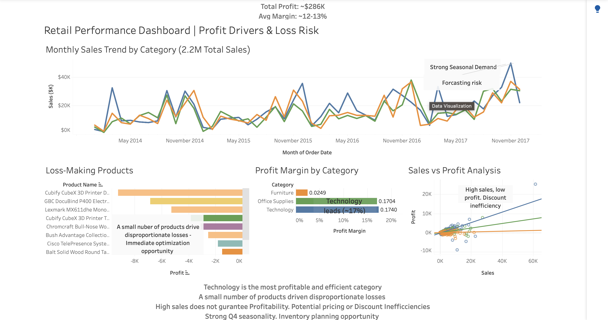

# Retail Profitability & Discount Impact Analysis using SQL

## Project Overview
This project analyzes retail sales data using SQL to evaluate business performance and identify opportunities to improve profitability.

## Business Objective
The goal of this analysis was to answer the following business questions:
- Is the business profitable overall?
- Which product groups generate the most revenue and profit?
- Which products are unprofitable overall?
- How do discount levels affect profitability?
- Are top-selling products also profitable?
- Is business growth consistent or volatile over time?

## Dataset
The dataset consists of transactional retail sales data, including product group, sales, profit, discount, quantity, and order date.

## Methodology
The analysis was conducted in PostgreSQL using aggregation, grouping, and filtering techniques to evaluate performance across product groups, discount levels, and time trends.

## Key Findings

### 1. Overall Profitability
The business generated approximately $2.29M in revenue and $286K in profit, resulting in a ~12–13% profit margin. While the business is profitable, the margin indicates clear opportunities for improvement through better pricing and cost optimization.

---

### 2. Category Performance Imbalance
Technology is the most profitable category (~17% margin), while Furniture significantly underperforms (~2% margin). This highlights structural inefficiencies within the Furniture category despite comparable sales levels.

---

### 3. Concentrated Loss Risk
A small number of products drive a disproportionate share of total losses. This indicates that profitability issues are highly concentrated, creating a clear and immediate opportunity for targeted optimization.

---

### 4. Discount Inefficiency
Higher discount levels are strongly associated with lower profitability. Discounts above ~30% consistently result in negative average profit, indicating that discounting is eroding margins rather than driving profitable growth.

---

### 5. Revenue vs Profit Disconnect
High sales volume does not guarantee profitability. Several high-revenue products generate low or negative profit, indicating inefficiencies in pricing or discount strategy.

---

### 6. Seasonal Demand & Forecasting Risk
Sales show clear seasonal patterns, with strong spikes in Q4. However, fluctuations across months suggest forecasting challenges and potential inefficiencies in inventory planning.

## Business Impact

This analysis highlights several actionable opportunities to improve profitability and operational efficiency:

- Identifying and addressing loss-making products such as Tables can directly improve overall profit without reducing revenue.
- Reducing excessive discounting above 30% can significantly protect margins and prevent large-scale profit erosion.
- Improving demand forecasting and inventory planning can reduce volatility and minimize inefficiencies in underperforming categories.
- Focusing on high-margin categories such as Technology can strengthen overall business performance.

Overall, the findings provide a clear path for increasing profitability through targeted, data-driven decisions rather than broad operational changes.

## Recommendations
- Limit discounting beyond the 20–30% range unless strategically justified.
- Review pricing, cost structure, and promotion strategies for loss-making products such as Tables, Bookcases, and Supplies.
- Improve demand forecasting and inventory planning, particularly for volatile product groups, to stabilize performance and protect margins.

## Tools Used
- PostgreSQL
- SQL

## Dashboard

An interactive Tableau dashboard was created to visualize key insights from the analysis.

🔗 View Dashboard: https://public.tableau.com/views/RetailPerformanceDashboard_17744148364860/RetailPerformanceDashboard-SalesProfitAnalysis?:language=en-US&publish=yes&:sid=&:redirect=auth&:display_count=n&:origin=viz_share_link

The dashboard highlights:
- Revenue and profit trends over time
- Discount impact on profitability
- Top-performing and loss-making products
## Dashboard Preview

## Project Files
- `queries.sql` — final SQL queries used in the analysis
